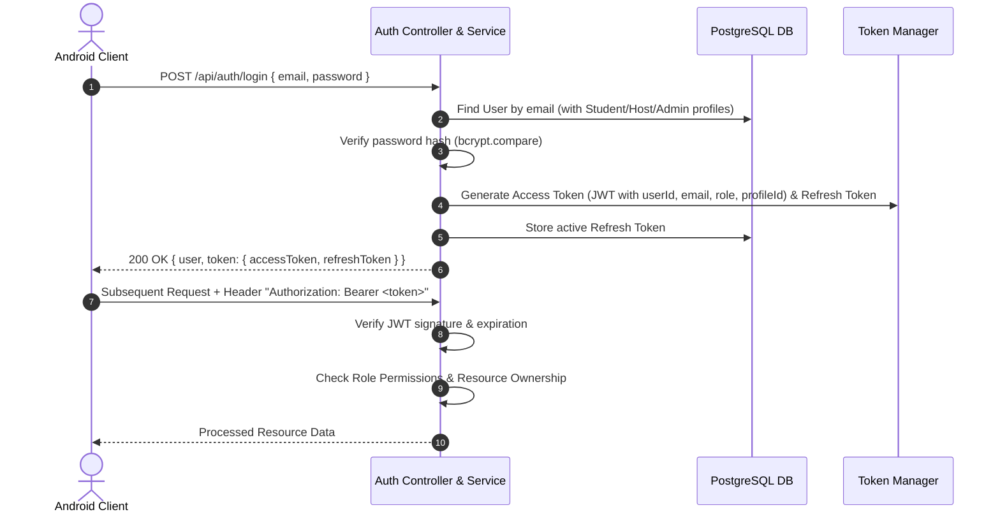

# HostelHub — Backend Implementation & Android Integration Architecture Plan

## 1. Executive Summary & Existing Architecture Analysis

### Current Architecture Overview
**HostelHub** is currently built as a single-client Android application with:
- **Presentation Layer**: Jetpack Compose UI with declarative screens for Students, Hosts, and Admins. ViewModels manage UI state using Kotlin Coroutines `StateFlow` and `UiState<T>`.
- **Domain Layer**: Clean Architecture domain models (`User`, `Student`, `Host`, `Admin`, `Hostel`, `Room`, `Bed`, `Fee`, `Payment`, `Complaint`, `AttendanceRecord`, `FoodMenu`, `Announcement`, `AppNotification`, `DashboardStats`) and repository interfaces in `Repositories.kt`.
- **Data Layer**: Local SQLite database via `HostelDatabaseHelper.kt` (using SQLiteOpenHelper) and raw SQL queries in `DatabaseDaos.kt`. Repository implementations in `DatabaseRepositories.kt` wrap DAO calls.
- **Dependency Injection**: Dagger Hilt binds local repository implementations to domain repository interfaces in `AppModule.kt`.
- **Demo/Mock Behavior**: Hardcoded user fallbacks (`std_001`, `host_001`, `admin_001`) and demo data fallback during login and screen initialization.

### Existing SQL Schema vs. Android Domain Models Comparison
- **`database/schema.sql`**: Contains 24 comprehensive relational tables with SQLite syntax (roles, users, hosts, admins, hostels, blocks, floors, rooms, beds, students, room_allocations, staff, fee_types, fees, payments, complaints, maintenance_logs, leave_requests, attendance_records, visitors, food_menus, announcements, notifications, audit_logs).
- **`app/src/main/java/.../domain/model/`**: Contains Kotlin data classes matching the core entities and enums.
- **Key Inconsistencies & Enhancements Identified**:
  1. Password storage in SQLite: Mock hashed passwords without real verification or salt. Remote backend requires proper bcrypt hashing (12 rounds) and JWT access/refresh token pairs.
  2. Bed allocation: SQLite repo has simple bed updates without atomic multi-step rollback. Backend requires atomic PostgreSQL transactions (`$transaction`) preventing race conditions and double-booking.
  3. Hardcoded IDs in ViewModels: ViewModels previously defaulted to `"std_001"` and `"hostel_001"`. With remote API, session context is resolved from the JWT payload and `GET /api/auth/me`.
  4. Response formatting: Remote API needs standardized `{ success: boolean, message: string, data?: any, errors?: any[] }`.

---

## 2. Remote Backend Architecture

### Tech Stack
- **Runtime**: Node.js (v24.x)
- **Language**: TypeScript (v5.x)
- **Web Framework**: Express.js
- **Database**: PostgreSQL (relational, ACID-compliant)
- **ORM**: Prisma ORM (v5.x / v6.x) with type-safe schema, migrations, and seed scripts
- **Authentication**: JWT (JSON Web Tokens) with Access Token (15m-1h) & Refresh Token (7d) rotation, bcryptjs password hashing
- **Validation**: Zod schema validation middleware
- **Documentation**: Swagger UI & OpenAPI 3.0 specification (`/api/docs`)
- **Security**: Helmet, CORS, Rate Limiting (express-rate-limit), central error handling middleware
- **Containerization**: Dockerfile and Docker Compose (`docker-compose.yml`)

### Directory Structure (`/backend`)
```text
backend/
├── prisma/
│   ├── schema.prisma
│   └── seed.ts
├── src/
│   ├── config/
│   │   ├── env.ts
│   │   └── swagger.ts
│   ├── middleware/
│   │   ├── auth.middleware.ts
│   │   ├── role.middleware.ts
│   │   ├── validate.middleware.ts
│   │   └── error.middleware.ts
│   ├── modules/
│   │   ├── auth/
│   │   │   ├── auth.controller.ts
│   │   │   ├── auth.service.ts
│   │   │   ├── auth.schema.ts
│   │   │   └── auth.routes.ts
│   │   ├── users/
│   │   ├── students/
│   │   ├── hosts/
│   │   ├── admins/
│   │   ├── hostels/
│   │   ├── rooms/
│   │   ├── beds/
│   │   ├── allocations/
│   │   ├── attendance/
│   │   ├── fees/
│   │   ├── payments/
│   │   ├── complaints/
│   │   ├── announcements/
│   │   ├── notifications/
│   │   ├── food-menu/
│   │   └── dashboard/
│   ├── utils/
│   │   ├── apiResponse.ts
│   │   ├── jwt.ts
│   │   └── password.ts
│   ├── routes/
│   │   └── index.ts
│   └── server.ts
├── tests/
│   ├── auth.test.ts
│   ├── allocations.test.ts
│   └── complaints.test.ts
├── .env.example
├── Dockerfile
├── docker-compose.yml
├── tsconfig.json
├── package.json
└── README.md
```

---

## 3. Database Entities & Relational Schema (PostgreSQL / Prisma)

The Prisma schema defines:
1. `Role` (Enum: `ADMIN`, `HOST`, `STUDENT`, `STAFF`)
2. `User` (id, email, passwordHash, role, fullName, phoneNumber, avatarUrl, isActive, fcmToken, createdAt, updatedAt)
3. `Host` (id, userId -> User, fullName, businessName, contactPhone, contactEmail, verifiedStatus, createdAt, updatedAt)
4. `Admin` (id, userId -> User, fullName, associationName, designation, permissions, contactPhone, createdAt)
5. `Student` (id, userId -> User, fullName, rollNumber, collegeName, course, yearOfStudy, gender, permanentAddress, emergencyContactName, emergencyContactPhone, hostelId -> Hostel, roomId -> Room, bedNumber, admissionDate, status, createdAt, updatedAt)
6. `Hostel` (id, hostId -> Host, name, address, city, state, postalCode, latitude, longitude, description, genderType, amenities, rules, images, totalRooms, totalBeds, occupiedBeds, baseMonthlyRent, cautionDeposit, rating, ratingCount, contactEmail, contactPhone, createdAt, updatedAt)
7. `Block` (id, hostelId -> Hostel, blockName, totalFloors, description, createdAt)
8. `Floor` (id, blockId -> Block, hostelId -> Hostel, floorNumber, totalRooms, createdAt)
9. `Room` (id, hostelId -> Hostel, blockId -> Block?, floorId -> Floor?, roomNumber, floor, block, roomType, totalCapacity, occupiedCount, monthlyRent, amenities, status, createdAt, updatedAt)
10. `Bed` (id, roomId -> Room, bedNumber, isOccupied, createdAt)
11. `RoomAllocation` (id, bedId -> Bed, roomId -> Room, hostelId -> Hostel, studentId -> Student, allocationDate, checkInDate, checkOutDate, status, allocatedBy -> User, remarks, createdAt, updatedAt)
12. `Staff` (id, userId -> User?, hostelId -> Hostel, fullName, roleTitle, phone, email, isAvailable, createdAt)
13. `FeeType` (id, hostelId -> Hostel, name, defaultAmount, billingCycle, createdAt)
14. `Fee` (id, hostelId -> Hostel, studentId -> Student, roomId -> Room?, title, feeType, amount, amountPaid, dueDate, billingMonth, billingYear, status, createdAt, updatedAt)
15. `Payment` (id, feeId -> Fee, studentId -> Student, hostelId -> Hostel, amountPaid, paymentMethod, transactionReference, paymentDate, receiptUrl, status, verifiedByHostId -> User?, remarks, createdAt)
16. `Complaint` (id, hostelId -> Hostel, studentId -> Student, studentName, roomNumber, category, title, description, attachments, urgency, status, assignedStaffName, hostNotes, resolutionSummary, createdAt, resolvedAt, updatedAt)
17. `MaintenanceLog` (id, complaintId -> Complaint?, hostelId -> Hostel, roomId -> Room?, performedByStaffId -> Staff?, issueType, actionTaken, cost, maintenanceDate, createdAt)
18. `LeaveRequest` (id, studentId -> Student, hostelId -> Hostel, startDate, endDate, reason, emergencyContactPhone, status, approvedBy -> User?, rejectionReason, remarks, createdAt, updatedAt)
19. `AttendanceRecord` (id, hostelId -> Hostel, studentId -> Student, studentName, roomNumber, date, status, checkInTime, remarks, markedBy, leaveRequestId -> LeaveRequest?, createdAt)
20. `Visitor` (id, hostelId -> Hostel, studentId -> Student, visitorName, relationship, phone, idProofType, idProofNumber, purpose, checkInTime, checkOutTime, approvedBy -> User?, status, remarks, createdAt)
21. `FoodMenu` (id, hostelId -> Hostel, weekStartDate, scheduleJson, specialNotice, isPublished, updatedAt, createdAt)
22. `Announcement` (id, hostelId, senderId -> User, senderRole, senderName, title, message, priority, targetAudience, attachmentUrls, createdAt, expiresAt)
23. `Notification` (id, recipientUserId -> User, title, body, type, relatedEntityId, isRead, createdAt)
24. `AuditLog` (id, userId -> User?, action, entityType, entityId, details, ipAddress, timestamp)
25. `RefreshToken` (id, userId -> User, token, expiresAt, revoked, createdAt)

---

## 4. Authentication Flow & Role-Based Access Control (RBAC)

### Authentication Lifecycle


### Role Permission Matrix
| Feature / Endpoint | STUDENT | HOST | ADMIN |
|---|---|---|---|
| Register / Login | Yes (Student flow) | Yes (Host flow) | Login (Admin pre-seeded) |
| View Own Profile | Yes | Yes | Yes |
| Hostels Directory | View & Filter | View/Manage own hostels | View & Manage all hostels |
| Room & Bed Management | View assigned room/bed | Full CRUD on own hostels | Full CRUD across all |
| Room Allocation (Bed Assign) | No | Yes (Within own hostel) | Yes |
| Bed Checkout / Vacate | No | Yes (Within own hostel) | Yes |
| Mark Attendance | Self-mark (if open) | Mark & Batch Mark for residents | View All |
| Fee Management | View own fees & history | Create fee, view hostel fees | View all university fees |
| Payment Processing | Initiate / Record payment | Verify payment & issue receipts | View revenue analytics |
| Complaints | Submit & track own | Assign staff, resolve, reject | View all complaints |
| Announcements | Read targeted/hostel | Publish to own hostel | Broadcast university-wide |
| Notifications | Read own notifications | Read own notifications | Read own notifications |
| Food Menu | View hostel menu | Manage & Publish hostel menu | View menus |
| Dashboards | Student Metrics | Host Hostel & Occupancy Stats | University Housing Overview |

---

## 5. API Endpoint Specifications

### 1. Authentication (`/api/auth`)
- `POST /api/auth/register/student` — Register student account and profile
- `POST /api/auth/register/host` — Register host account and business profile
- `POST /api/auth/login` — Authenticate and receive JWT pair
- `POST /api/auth/refresh` — Issue new access token using valid refresh token
- `POST /api/auth/logout` — Invalidate refresh token and logout
- `GET  /api/auth/me` — Return current authenticated user and linked profile

### 2. Users (`/api/users`)
- `GET   /api/users` — List all users (Admin only)
- `GET   /api/users/:id` — Get user profile by ID
- `PATCH /api/users/:id` — Update user profile
- `PATCH /api/users/:id/status` — Toggle active/inactive status (Admin only)

### 3. Students (`/api/students`)
- `GET    /api/students` — List students (Hostel/search filtering)
- `GET    /api/students/:id` — Get single student profile
- `PATCH  /api/students/:id` — Update student profile
- `DELETE /api/students/:id` — Delete student (Admin/Host)
- `GET    /api/students/:id/dashboard` — Student dashboard metrics

### 4. Hosts (`/api/hosts`)
- `GET   /api/hosts` — List hosts (Admin only)
- `GET   /api/hosts/:id` — Get host details
- `PATCH /api/hosts/:id/verify` — Admin verify host

### 5. Hostels (`/api/hostels`)
- `GET    /api/hostels` — Query hostels (filters: `city`, `gender`, `minRent`, `maxRent`)
- `POST   /api/hostels` — Create new hostel (Host/Admin)
- `GET    /api/hostels/:id` — Get hostel details with blocks/rooms
- `PATCH  /api/hostels/:id` — Update hostel details
- `DELETE /api/hostels/:id` — Delete hostel

### 6. Rooms & Beds (`/api/rooms`, `/api/beds`)
- `GET    /api/hostels/:hostelId/rooms` — Get rooms for hostel
- `POST   /api/hostels/:hostelId/rooms` — Add room
- `GET    /api/rooms/:id` — Get room by ID with beds
- `PATCH  /api/rooms/:id` — Update room
- `DELETE /api/rooms/:id` — Delete room
- `GET    /api/rooms/:roomId/beds` — Get beds in room
- `POST   /api/rooms/:roomId/beds` — Add bed
- `PATCH  /api/beds/:id` — Update bed
- `DELETE /api/beds/:id` — Delete bed

### 7. Allocations (`/api/allocations`)
- `POST  /api/allocations` — Atomic bed allocation transaction
- `PATCH /api/allocations/:id/checkout` — Atomic vacate/checkout transaction
- `GET   /api/allocations/student/:studentId` — Student allocation history

### 8. Attendance (`/api/attendance`)
- `POST /api/attendance` — Mark single attendance record
- `POST /api/attendance/batch` — Batch mark attendance
- `GET  /api/attendance/student/:studentId` — Filter by `month`, `year`
- `GET  /api/attendance/hostel/:hostelId` — Filter by `date`

### 9. Fees & Payments (`/api/fees`, `/api/payments`)
- `GET   /api/fees/student/:studentId` — List student fees
- `GET   /api/fees/hostel/:hostelId` — List hostel fees
- `GET   /api/fees` — List all fees (Admin)
- `POST  /api/fees` — Create fee
- `PATCH /api/fees/:id` — Update fee
- `GET   /api/payments/student/:studentId` — List student payments
- `POST  /api/payments` — Record payment transaction (updates fee status atomically)
- `GET   /api/payments/:id` — Get payment receipt

### 10. Complaints (`/api/complaints`)
- `POST  /api/complaints` — Submit new complaint
- `GET   /api/complaints/student/:studentId` — List student complaints
- `GET   /api/complaints/hostel/:hostelId` — List hostel complaints
- `GET   /api/complaints` — List all complaints (Admin)
- `GET   /api/complaints/:id` — Get complaint details
- `PATCH /api/complaints/:id` — Update status, staff assignment, resolution notes
- `DELETE /api/complaints/:id` — Delete complaint

### 11. Announcements (`/api/announcements`)
- `GET    /api/announcements` — List announcements (filtered by hostel/audience)
- `POST   /api/announcements` — Create announcement
- `GET    /api/announcements/:id` — Get announcement
- `DELETE /api/announcements/:id` — Delete announcement

### 12. Notifications (`/api/notifications`)
- `GET   /api/notifications` — List user notifications
- `PATCH /api/notifications/:id/read` — Mark notification as read
- `PATCH /api/notifications/read-all` — Mark all as read

### 13. Food Menu (`/api/food-menu`)
- `GET   /api/food-menu` — Get weekly menu for hostel (`hostelId`, `weekStartDate`)
- `POST  /api/food-menu` — Create / Publish weekly menu
- `PATCH /api/food-menu/:id` — Update menu

### 14. Dashboards (`/api/dashboard`)
- `GET /api/dashboard/student` — Aggregated student dashboard metrics
- `GET /api/dashboard/host` — Aggregated host dashboard metrics
- `GET /api/dashboard/admin` — Aggregated admin housing statistics

---

## 6. Android Integration Strategy

### Remote Network Layer Architecture
```text
app/src/main/java/com/hostelhub/app/data/remote/
├── api/
│   ├── AuthApi.kt
│   ├── StudentApi.kt
│   ├── HostelApi.kt
│   ├── RoomApi.kt
│   ├── FeePaymentApi.kt
│   ├── ComplaintApi.kt
│   ├── AttendanceApi.kt
│   ├── FoodMenuApi.kt
│   ├── AnnouncementApi.kt
│   ├── NotificationApi.kt
│   └── DashboardApi.kt
├── dto/
│   ├── ApiResponseDto.kt
│   ├── AuthDtos.kt
│   ├── StudentDtos.kt
│   ├── HostelDtos.kt
│   ├── RoomDtos.kt
│   ├── FeePaymentDtos.kt
│   ├── ComplaintDtos.kt
│   ├── AttendanceDtos.kt
│   ├── FoodMenuDtos.kt
│   └── AnnouncementDtos.kt
├── interceptor/
│   ├── AuthInterceptor.kt
│   └── TokenAuthenticator.kt
├── datasource/
│   └── TokenManager.kt
└── repository/
    ├── RemoteAuthRepositoryImpl.kt
    ├── RemoteStudentRepositoryImpl.kt
    ├── RemoteHostelRepositoryImpl.kt
    ├── RemoteRoomRepositoryImpl.kt
    ├── RemoteFeePaymentRepositoryImpl.kt
    ├── RemoteComplaintRepositoryImpl.kt
    ├── RemoteAttendanceRepositoryImpl.kt
    ├── RemoteFoodMenuRepositoryImpl.kt
    ├── RemoteAnnouncementRepositoryImpl.kt
    └── RemoteNotificationRepositoryImpl.kt
```

### Dependency Injection Updates
- In `AppModule.kt`, replace `@Binds` from `Database...RepositoryImpl` to `Remote...RepositoryImpl`.
- Provide `@Provides @Singleton fun provideRetrofit(...)` with OkHttpClient, base URL (configurable for `10.0.2.2:5000` for Android Emulator, or LAN IP for physical device), JSON serialization converter, logging interceptor, and AuthInterceptor.

### Migration Steps
1. Add Retrofit, OkHttp, and serialization dependencies in Gradle.
2. Create DTOs and Retrofit API interfaces.
3. Implement `TokenManager` for JWT access and refresh token persistence.
4. Implement `Remote...RepositoryImpl` classes fulfilling existing domain repository interfaces.
5. Update `AppModule` to inject remote repositories.
6. Connect ViewModels dynamically to authenticated user data without hardcoded demo fallbacks.
7. Test end-to-end user flows (Student login/registration, Host management, Admin oversight).
